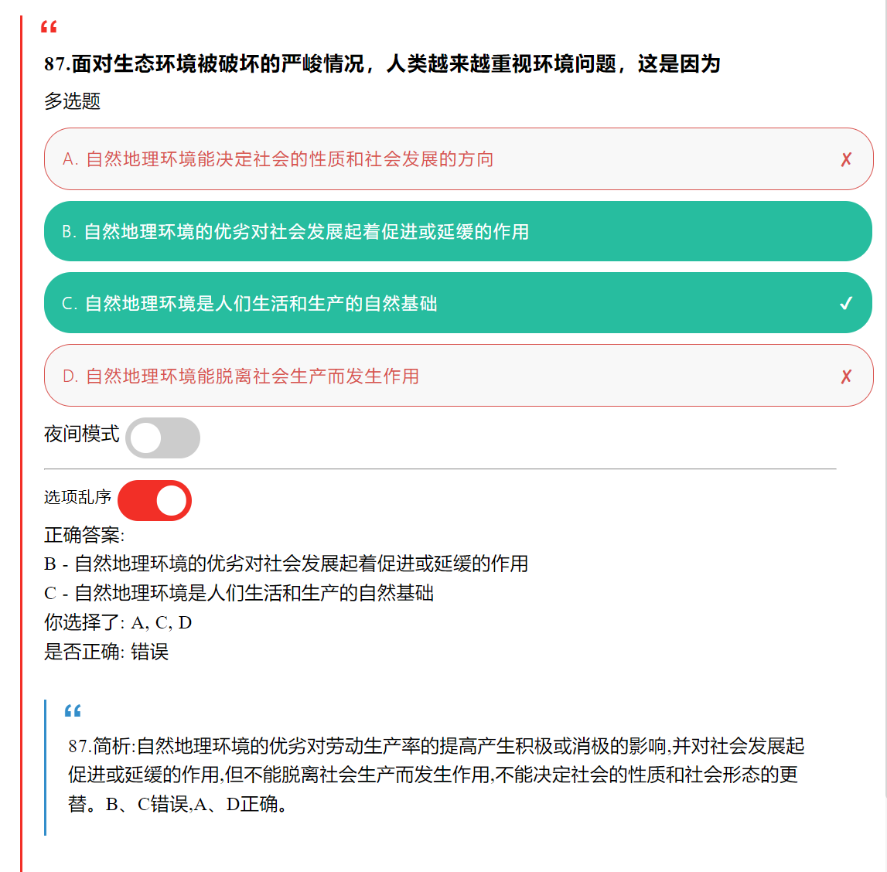
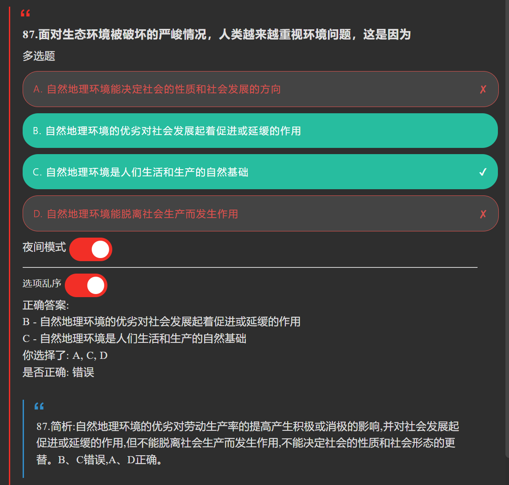

# anki-template-choices

自用选择题 anki 模板

测试用 anki 卡组包已放在 release 和 [repo 里](for-testing.apkg)

如果你遇到了加密 anki 卡组，我推荐你可以尝试一下 https://gist.github.com/nonefffds/532580aaa591d01f40c5d2c387fac129 的脚本进行解密，参考文档：https://oddpaw.com/2023/07/decrypt-anki-deck/ ，非常感谢原作者的分析和代码提供

## 功能

- 选项乱序
- 支持单选/多选
- 判断正确答案
- 在Anki for Windows/Ankiweb/AnkiDroid动作良好，其他未测试
- 夜间模式
- 单张卡片计时(beta)
- 正确率统计(beta)

注：新卡片不清除上一张选择的记录是feature，不是bug

## TO-DO：

- latex支持
- 样式优化
- 写使用方式
- 支持简答题

## 效果

### 日间

### 夜间

## tips：

卡组字段分别是：

- 问题
- 选项
- 答案
- 解析

其中选项需要打开“默认使用HTML编辑器”，每个选项用`` ``隔开

以下为选项例：

``作为观察当代世界变化的工具 指导中国发展的行动指南 引领人类社会进步的科学理论 提供革命、建设、改革的固定方案``

答案为选项的序号，以英文逗号或中文逗号隔开，以下是答案例：

``1,2,3``

``4``

``1，2，3``

以下是 formatSchemeB-*.html 的选项例，每个选项以`|`隔开：

``作为观察当代世界变化的工具|指导中国发展的行动指南|引领人类社会进步的科学理论|提供革命、建设、改革的固定方案``

答案不需要任何分割，以下是答案例：

``ABCD``

## 致谢
[参考了 cyliu-phy/simple-anki-template 的样式](https://github.com/cyliu-phy/simple-anki-template)
