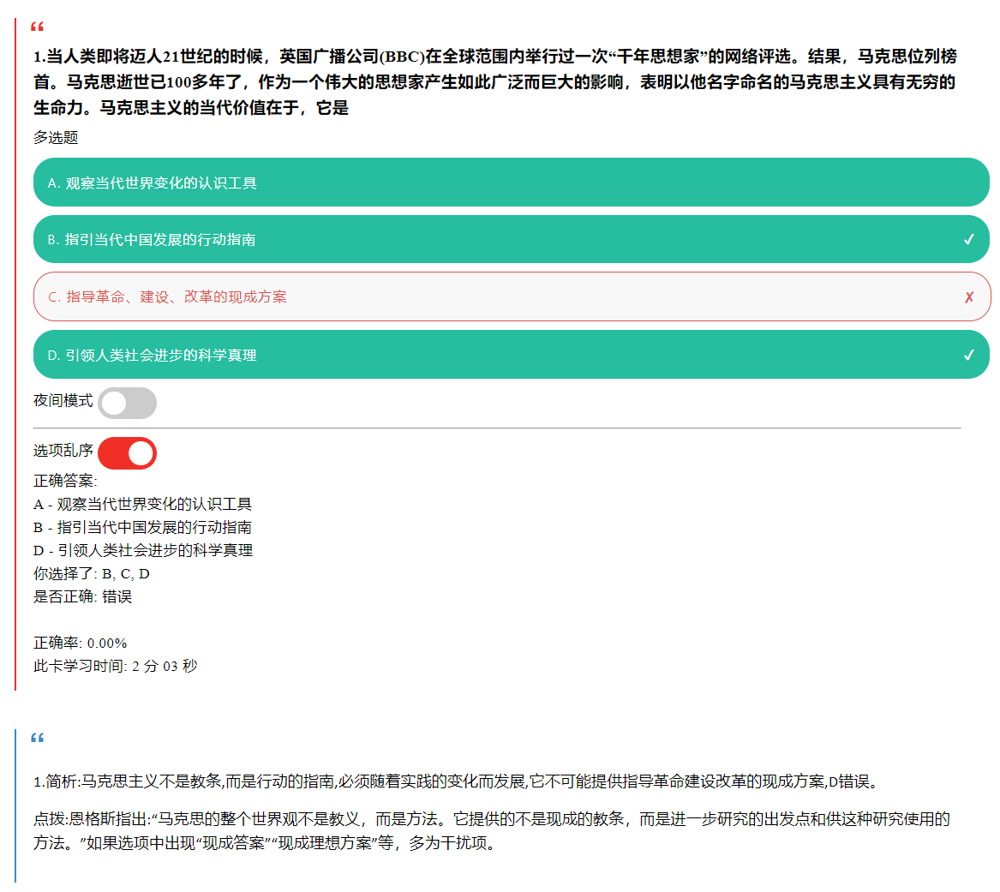
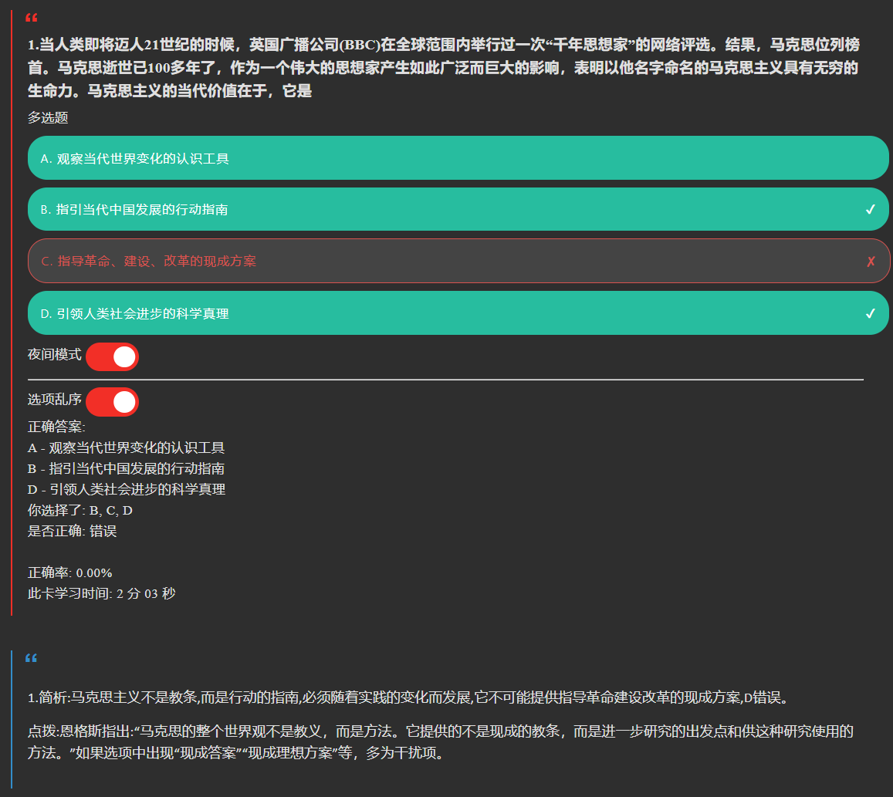

# anki-template-choices

自用选择题 anki 模板

## 功能

- 选项乱序
- 支持单选/多选
- 判断正确答案
- 在Anki for Windows/AnkiDroid上兼容性可能最好，Ankiweb 上可能会有字体缺失
- 夜间模式

## TO-DO：

- 计时
- 正确率统计
- latex支持
- 样式优化
- 写使用方式
- 导出apkg样版

## 效果

### 日间

### 夜间

## 致谢
[参考了 cyliu-phy/simple-anki-template 的样式](https://github.com/cyliu-phy/simple-anki-template)
